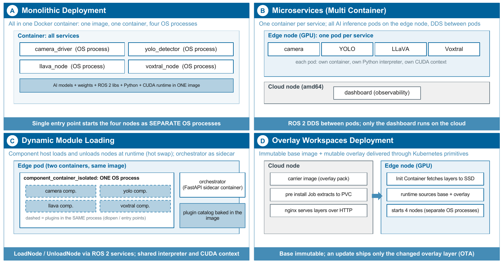
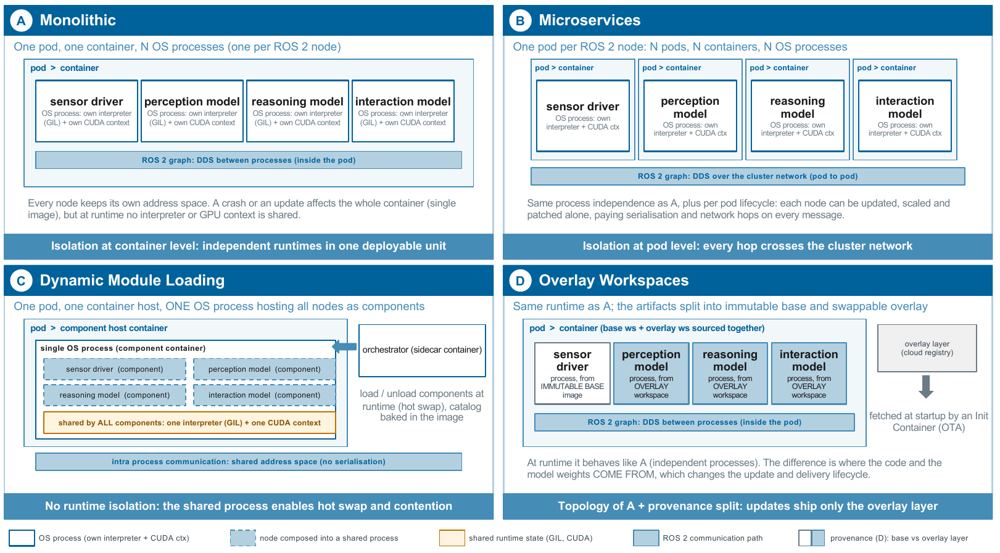

# Analysis of Distributed AI Model Architectures for Cloud-Edge Robotic Systems Utilizing ROS 2

[](LICENSE)
[](https://doi.org/10.5281/zenodo.20492495)

Reproducibility artifact for the article *"Analysis of Distributed AI
Model Architectures for Cloud-Edge Robotic Systems Utilizing ROS 2"*
(IEEE Access, 2026, under revision). This repository contains the
complete source code, Helm charts, benchmark scripts and raw
measurement data of the comparative evaluation of four ROS 2 deployment
patterns — *monolithic containers*, *microservices*, *dynamic module
loading* and *overlay workspaces* — running a multimodal AI workload
(YOLOv8-nano + LLaVA-1.5-7B + Voxtral-Mini-3B) on a K3s cluster pairing
an NVIDIA Jetson AGX Orin edge node with two amd64 cloud nodes.

> If you use this artifact please cite both the article and this
> repository (see [CITATION.cff](CITATION.cff)).



## Artifact map: from the paper to the repository

Naming note: the repository uses short pattern names; the paper uses
the long ones. `Patterns/overlay` = *overlay workspaces*,
`Patterns/dynamic-loader` = *dynamic module loading*.

| In the paper | In this repository |
|---|---|
| Pattern descriptions and topology (Sections III and IV) | `Patterns/<pattern>/helm/` (charts), `Models/` (images and node source) |
| Measurement procedures (Section IV) | `scripts/benchmark/run_full_campaign.sh` and the capture scripts it drives |
| Deployment regimes: warm, image cache cold, fully clean (Section IV) | `COLD_MODE` in `run_full_campaign.sh`; matrix driver `run_coldstart_matrix.sh` |
| Install time tables and figures (Section V) | raw cycles in `results/_campaigns/<TS>/comparison.csv`, regime in `REGIME.txt` |
| Runtime metrics, queue wait and drop counters (Section V) | `scripts/benchmark/sample_dashboard_metrics.py`, per cycle samples under `results/_campaigns/<TS>/<pattern>/` |
| Trigger sensitivity sweep (Section V) | `run_sensitivity_campaign.sh`, index `results/_campaigns/sensitivity_index_*.csv` |
| Hybrid composition of the dynamic pattern (Section V) | `hybrid.enabled` in `Patterns/dynamic-loader/helm/dynamic-loader/values.yaml` |
| Update cycle comparison (Section V) | `scripts/benchmark/measure_update_cycle.sh` |
| Repeated hot swap endurance (Section V) | `scripts/benchmark/capture_hotswap_endurance.sh` |
| Process and container topology evidence | `scripts/benchmark/capture_process_topology.sh`, captures under `results/topology/` |
| Statistics: means and 95 percent confidence intervals | `scripts/benchmark/aggregate_with_ci.py` (stdlib only) |
| Try your own model under the four patterns | [`template/`](template/README.md) |

## Repository layout

```
.
├── Models/                      # source code of the container images
│   ├── ros2_base/               #   ROS 2 Humble + CUDA L4T base image
│   ├── ros2_cam_ws/             #   camera driver
│   ├── ros2_yolo_ws/            #   YOLOv8-nano detector (GPU)
│   ├── ros2_llava_ws/           #   LLaVA-1.5-7B vision language (GPU)
│   ├── ros2_voxtral_ws/         #   Voxtral-Mini-3B voice interaction
│   ├── ros2_monolithic_ws/      #   monolithic image (4 nodes, one image)
│   ├── ros2_overlay_pack/       #   overlay carrier (deps + models payload)
│   ├── ros2_component_host/     #   dynamic pattern host + orchestrator
│   └── ros2_dashboard/          #   web control panel (rosbridge + nginx)
│
├── Patterns/                    # the four Helm charts
│   ├── monolithic/helm/
│   ├── microservices/helm/ros2-microservices/
│   ├── dynamic-loader/helm/dynamic-loader/
│   └── overlay/helm/ros2-overlay/
│
├── scripts/benchmark/           # automated measurement campaigns
│   ├── run_full_campaign.sh           # core campaign (regimes via COLD_MODE)
│   ├── run_coldstart_matrix.sh        # warm + image cold + fully clean matrix
│   ├── run_sensitivity_campaign.sh    # LLaVA trigger period sweep
│   ├── measure_update_cycle.sh        # equivalent update op per pattern
│   ├── capture_hotswap_endurance.sh   # repeated swap cycles + memory watch
│   ├── capture_process_topology.sh    # live process/container evidence
│   ├── capture_dynamic_load_unload.sh # per module hot swap timing
│   ├── sample_dashboard_metrics.py    # rosbridge sampler (runtime metrics)
│   ├── llava_trigger_driver.py        # deterministic /llava/trigger publisher
│   └── aggregate_with_ci.py           # mean, std, CI95, p50/p95, drops
│
├── results/                     # raw measurement data (committed)
│   ├── _campaigns/<TS>/         #   one dir per campaign; REGIME.txt inside
│   ├── topology/                #   live process/container captures
│   └── overlay_incremental_warm/
│
├── template/                    # bring your own model under the 4 patterns
├── dashboard/                   # standalone HTML dashboard (rosbridge UI)
├── LICENSE                      # Apache 2.0
└── CITATION.cff                 # citation metadata for Zenodo / GitHub
```

## The four deployment patterns at a glance

| Pattern | What it is | Lifecycle property exercised |
|---|---|---|
| **Monolithic** | One image bundling ROS 2 runtime and the four AI nodes as separate OS processes. | Simplest unit; any update re ships the full image. |
| **Microservices** | One image and one pod per service, DDS across pods. | Per service isolation, update and patching. |
| **Dynamic loading** | One component host process that loads and unloads the nodes as plugins at runtime. | Hot swap in seconds; shared interpreter and CUDA context. |
| **Overlay workspaces** | Immutable base image plus a mutable carrier extracted cloud side and fetched by the edge. | Bounded OTA payload; base never re ships. |

Image sizes and all measured numbers are reported in the article with
confidence intervals; the raw values per cycle live in
`results/_campaigns/`.

The runtime topology below is the key to understanding the results:
where the process, container and pod boundaries fall in each pattern,
and what runtime state is shared.



## How to reproduce the campaigns

1. Provision a K3s cluster matching the topology in the article (one
   Jetson AGX Orin edge node, two amd64 cloud nodes).
2. Set up SSH and passwordless `sudo k3s` from the control plane to the
   cluster nodes (required by the image purge of the cold regimes), and
   passwordless `sudo rm` on the edge for the fully clean regime.
3. Build and push the container images
   (`Models/*/docker/Dockerfile`) to your registry. BuildKit is
   required, plus an `HF_TOKEN` secret with access to the gated
   Voxtral-Mini-3B repository. Note the architecture split: images that
   run on the edge are arm64; the overlay carrier must be built with
   `--platform linux/amd64` (see `Models/ros2_overlay_pack/docker/Dockerfile`).
4. Create the `ros2exp` namespace and the `regcred` pull secret.
5. Run the deployment regime matrix (three regimes, four patterns):

   ```bash
   N_WARM=5 N_IMAGECOLD=3 N_PRISTINE=3 \
     nohup bash scripts/benchmark/run_coldstart_matrix.sh > matrix.log 2>&1 &
   ```

6. Run the trigger sensitivity sweep:

   ```bash
   nohup bash scripts/benchmark/run_sensitivity_campaign.sh > sensitivity.log 2>&1 &
   ```

7. Aggregate everything with confidence intervals:

   ```bash
   python3 scripts/benchmark/aggregate_with_ci.py
   ```

Campaigns write one directory per run under `results/_campaigns/`,
including the exact regime (`REGIME.txt`), the raw rosbridge samples
and the per pattern artifacts. Cycles excluded from the statistics of
the article (cache priming, operator induced contention) are documented
in the reproducibility notes of each campaign index.

## Try your own model

The [`template/`](template/README.md) directory lets you evaluate your
own model under the four patterns without editing any chart: implement
two methods in a template ROS 2 package, build with the provided
Dockerfiles, and the full measurement methodology of the article
(regimes, runtime metrics, confidence intervals) applies to your model
unchanged.

## Pre-built images

The images used in the published measurements are mirrored in the
institutional GitLab registry of CIGIP-UPV and can be made available
upon reasonable request to the corresponding author. The Dockerfiles in
this repository are sufficient to rebuild equivalent images on any host
with NVIDIA Container Toolkit support.

## Workload

- **YOLOv8-nano** for real time detection.
- **LLaVA-1.5-7B** for vision language reasoning, triggered
  deterministically (period configurable; the article sweeps 30, 60,
  120 and 300 s) via `scripts/benchmark/llava_trigger_driver.py`.
- **Voxtral-Mini-3B** for voice interaction.

The four deployment patterns receive identical workloads and identical
ROS 2 application code; they differ only in how the nodes are packaged,
delivered and started.

## Citing

Please cite both the article and this repository. `CITATION.cff` is set
up so that GitHub and Zenodo render the citation metadata
automatically. The revision submitted to IEEE Access is frozen as a git
tag so the article can reference an immutable revision of this
artifact.

## Authors

Miguel Ángel Mateo-Casalí ([ORCID](https://orcid.org/0000-0001-5086-9378)),
Daniel González El Yachouti ([ORCID](https://orcid.org/0009-0005-5163-0509)),
Francisco Fraile ([ORCID](https://orcid.org/0000-0003-0852-8953)),
Andrés Boza ([ORCID](https://orcid.org/0000-0002-5429-0416))
— Centro de Investigación en Gestión e Ingeniería de Producción
(CIGIP), Universitat Politècnica de València, Spain.

Corresponding author: **mmateo@cigip.upv.es**.

## License

Apache License 2.0 — see [LICENSE](LICENSE).
