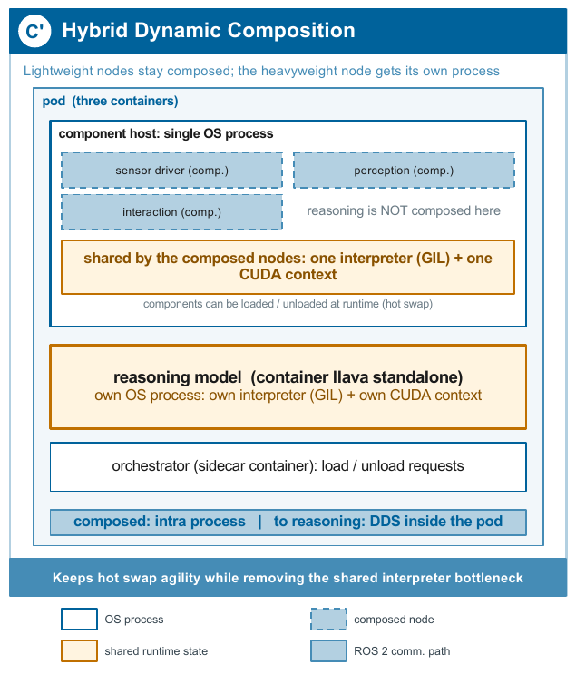

# BYOM: dynamic module loading pattern

Your package is compiled into the component host workspace, so the plugin
entry point `yolo_detector_pkg::YoloDetector` resolves to your class. The
bootstrap Job loads it at install time under the module name `yolo`, and
`hotswap_example.sh` shows how to unload and reload it at runtime through the
orchestrator sidecar, which is the distinctive property of this pattern.

Keep in mind the finding of the paper: everything loaded in the component
host shares ONE Python interpreter (GIL) and ONE CUDA context. If your model
sustains long forward passes, it will serialise the other composed nodes;
consider the hybrid composition (`hybrid.enabled=true` in the chart values)
that runs the heavyweight model as a separate process:



```
export REG=<registry>/<project>
export TAG=mymodel-v1
bash template/dynamic-loader/deploy.sh
bash template/dynamic-loader/hotswap_example.sh
```
